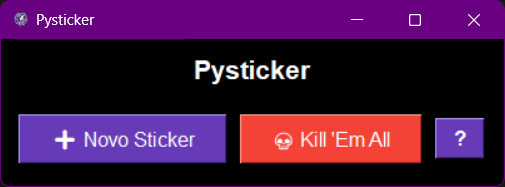

# Pysticker

Um .py para espalhar stickers pela sua tela com todas aquelas ideias que você provavelmente não vai fazer (mas deveria).




---

### Principais Funcionalidades

*   **Criação Simples:** Crie e delete notas com um clique.
*   **Cores Personalizáveis:** Organize ideias com sistema de cores.
*   **Persistência Automática:** Suas notas são salvas localmente e reaparecem quando o app é reiniciado.
*   **Sempre à Vista:** As notas flutuam sobre as outras janelas para manter seus lembretes em foco.
*   **Layout Flexível:** Mova e redimensione as notas como quiser.

### Como Executar

**Requisito:** Python 3

1.  **Clone o repositório:**
    ```sh
    git clone https://github.com/augustocesarperin/pysticker.git
    ```
2.  **Navegue até a pasta:**
    ```sh
    cd pysticker
    ```
3.  **Execute o aplicativo:**
    ```sh
    python main.py
    ```


